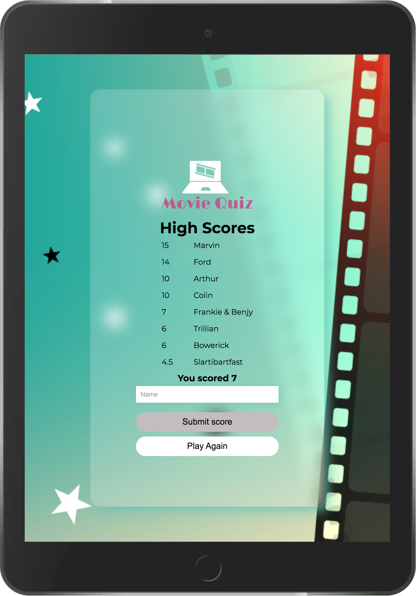
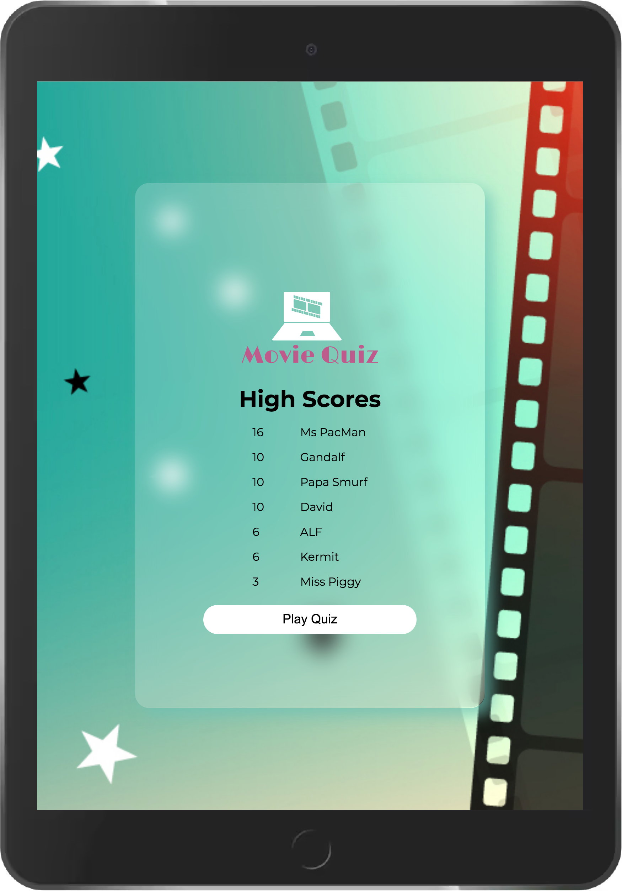

# Movie Quiz

Welcome, this is my movie question site.
The goal of the site is to provide a fun quiz game with 10 questions, 
with an option to choose a difficulty level which will vary the points per question. 

## Project Overview

This Movie Quiz is a website that aims to provide a fun challenge for the end-user with a quiz. This creation of this site is part of my Portfolio Project 2 for Code Institute. The initial aim of the site is to show my newly developing knowledge of JavaScript whilst continuing to develop my HTML and CSS.

__Site User Goals:__

- I want to be able to an online quiz to test my knowledge of movies.
- I want to be able to select a difficulty level for the quiz.
- I want to see my progress whilst playing the quiz game.
- I want to track my score during the quiz game, with a visualisation of how many points I have accrued.
- I want to see how many questions I have answered and how many are left.
- I want to view my final score after the quiz game has ended and to be able to save my score if I wish.
- I want to be able to replay the quiz game without repeating the same questions each time.
- I want to be able to view the high scores table of my previously saved scores.
- I want to have the option to quit the quiz game before finishing it.

 __Site Owner Goals:__

- I want to provide a challenging quiz to entertain online users.
- I want to enable the user to easily navigate the site and game without encountering any difficulty.
- I want the user to return and replay the quiz.
- I want the user to record their high scores to give the incentive to return to replay the game to improve the score.
- I want the user to be able to select a difficulty level for the questions.
- I want the difficulty of the questions to reflect on the value of points per question.

## Features

- __The Welcome Page__

- The welcome page displays an image in the background with a glass style container floating above. This container blurs the image below, the 'glass' container is used throughout the quiz app for all the sections.
- The container contains the logo with brief instructions explaining the point scoring system.
  - The buttons are self-explanatory.
  - A button with a dropdown list for the difficulty level.
  - A button to play the game, and a button, and
  - A button to view the high scores.

The points values are input within the Javascript file `const pointsPerCorrectAnswerEasy = 1` which updates the text on the welcome page. This ensures that if the scores are updated, from within the javascript file, the welcome page points section does not require updating manually.
  
 

- __The Level Selection Process__

  A self intuitive level selection process was used for the game which defaults to easy.
  - The obvious difficulty levels added were:
    - Easy,
    - Medium, and
    - Hard.
  

- __High Scores Section__
This section has a table created from the user's session storage, when first opening the session storage is populated with some example names and scores from the Javascript file, this ensures that the high scores page isn't blank when first opening.
There is also included on this page a button to return to the home screen.
There are 11 sample high scores created initially, before being sorted and only the top ones indicated by the const `highScoresToShow = value` are kept.
The score values are created randomly using the point values and the total amount of questions to be asked within the quiz. This is calculated for the Hard, Medium and Easy values
    `(Math.floor(Math.random() * SetQtyOfQuestions) + 1) * pointsPerCorrectAnswer`
This has been done to help have a randomness of high scores and names populating the high scores table, but mainly because I could and I thought it would be fun.  I don't expect the user to ever realise this is happening.
  
  
  
- __The Quiz Section__

  - The quiz page included the logo at the top.
  - The questions are populated randomly from the questions fetched from [Open Trivia (API) Database](https://opentdb.com/api_config.php). The quiz is set to return 10 questions, but is easily amended through `const SetQtyOfQuestions = 10`. These questions are obtained according to the difficulty level selected by the user. Instead of just 10 questions fetched from the API there is a multiplication factor used  to return more questions from the API `const questionsToFetchMultiplier = 3;`, this was reduced from 5 as there wasn't 50 questions within the hard questions selection in the API. this helps with the randomness of the questions. on testing if only 10 questions are fetched from the API it was the same 10 questions fetched each time, spoiling the quiz gameplay on any repeat attempts.
  - When an answer is selected the question either lights up Red for incorrect or green for correct.
  - When an answer is selected there is a sound, either a buzz or a ding to indicate if the answer was incorrect or correct, this feature is able to be turned off or on by the mute/play button at the bottom right of the play screen.
  - When an incorrect answer is selected there is an indication around the correct answer, to let the user know which answer was correct.
  - Beneath the answers there is a progress section, this has a question counter with a progress bar, the progress bar has rounded corners with the internal bar being flat on the right until the final question when this too becomes rounded.
  - There is also the scoring on the right, this is increased each time a question is answered correctly according to the point value indicated by the difficulty level selected by the user.
  - Just encase the user becomes bored during the gameplay (although I couldn't possibly see why they would) There is an exit game button. This overlays an exit screen over the quiz with a warning that exiting at this time will lose the current quiz session and score, with two buttons.
    - A green button to continue back to the quiz, and
    - A red button to return to the welcome screen

- __Submitting High Scores__

  - After completing the quiz, The user's final score is displayed with the current high scores and, if the user has scored higher than the lowest score on in the high scores list the option to save their score is displayed, 
  otherwise just the play again button is displayed.
  
  - The score is submitted and only the top scores are retained. This retention value is easily amended within `const highScoresToShow = 8` at the top section of the Javascript file.
 
 